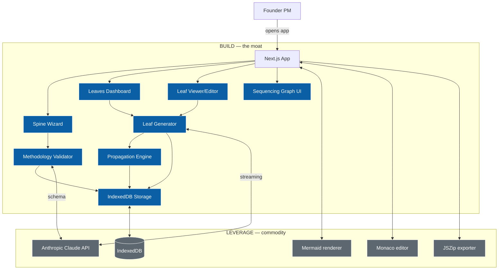

# Saplings — Build Brief for Claude Code

> **Working title:** Saplings (young Leaf-bearing trees). Final brand can be chosen later — leave the brand name as a placeholder constant `APP_NAME` and pick a final name in week 2.

> **What this document is.** A complete, opinionated build brief for an MVP of an app that operationalizes the *Spine and Leaf* product-delivery methodology. Hand this entire file to Claude Code as the project brief. Decisions are made; Claude Code should execute, not ask.

> **What the methodology is.** Documented separately in `spine_and_leaf_whitepaper.docx`. Short version: a PM authors a *Spine* (the immutable customer narrative). From it, six *Leaves* are produced — Architecture, Engineering, GTM, Design, Compliance, Sequencing. Each Leaf serves a specific discipline. When the Spine changes, all Leaves propagate. This app turns that methodology into a tool.

> **What you're building.** A web application where a PM types a problem statement, the app interrogates them through a structured wizard to produce a Spine, then generates the other five Leaves automatically. The app stores everything locally (IndexedDB) for the MVP, exports as a ZIP bundle, and renders each Leaf in a dedicated viewer. No authentication, no cloud sync, no integrations in the MVP — those are Pilot/GA scope.

---

## 1. The Spine for Saplings itself

This is the Spine of the app you are building. It is the load-bearing artifact every other section of this brief must trace back to.

**Problem.** Founder-PMs and senior PMs lose 1–2 weeks at the start of every initiative authoring artifacts (PRDs, wireframes, system diagrams, traceability matrices, GTM tours) by hand. Most of those artifacts are 60–80% derivable from a clean problem statement. The translation work is expensive and lossy. Existing tools (Jira, Linear, Notion, Figma, ChatGPT) each handle one slice but none synthesize a coherent system that propagates when the source changes.

**User.** Maya, a founder-PM at a 6-person seed-stage startup. Technical background, no design team, no formal PM training. Has 3 hours on a Monday evening to figure out what to ship in the next two weeks. Currently jumping between ChatGPT (for the PRD), Figma (for wireframes she half-finishes), Linear (for ticket creation), and a Notion doc that's already drifted from the Linear backlog. Wants one place to author a coherent system.

Secondary user: Vikram, a Senior PM at a 200-person SaaS company piloting Spine and Leaf on one project. He needs the artifacts in formats his existing team (engineers in Linear, designers in Figma, sales in HubSpot) can pick up directly.

**Direction.** A web app where the PM types or pastes a problem statement, the app interrogates them through a 5-step wizard to produce a clean Spine (markdown, version-controlled), then auto-generates draft versions of the other five Leaves in parallel. Each Leaf has its own viewer/editor. When the PM updates the Spine, the app propagates: it identifies which Leaves are affected, asks the PM to confirm, regenerates the affected Leaves, and bumps the spine version. The whole project exports as a ZIP that can be checked into a repo.

**Success metrics (MVP).**
- M1: Time from blank screen to all 6 Leaves drafted < 15 minutes (median, measured via instrumentation).
- M2: 80%+ of users who complete the Spine wizard generate at least one Leaf they keep without major edits.
- M3: ZIP export works with valid file structure 100% of the time (covered by automated tests).
- M4: Propagation correctly identifies affected Leaves with > 90% accuracy on a labeled test set of 20 Spine diffs.

**Scope (MVP).**
- **In:** Spine wizard (5 steps), Leaf generators (6 leaves), Leaf viewers/editors, propagation flow when Spine changes, IndexedDB-backed local storage, ZIP export of all artifacts, Mermaid rendering for Architecture and Sequencing diagrams, HTML iframe preview for the Engineering Leaf, the live Sequencing Leaf demo (work-item routing graph with slice + discipline filters and click-to-cycle status — port from `sequencing_leaf_demo.html`).
- **Out:** Authentication, cloud sync across devices, multi-user collaboration, GitHub integration, Jira/Linear integration, Figma export, billing, account system, public sharing, comments, history/diff browser. All deferred to Pilot scope.

**Commitments (traceable from Leaves).**
- C1 — User can produce a complete Spine through a guided wizard in under 5 minutes.
- C2 — User can generate all 6 Leaves with one click after the Spine is accepted.
- C3 — User can edit any Leaf and regenerate it without losing other Leaves.
- C4 — When the Spine changes, the app identifies which Leaves are affected and offers to regenerate them.
- C5 — User can export the full project as a ZIP.
- C6 — All data persists locally so users can close the tab and return.
- C7 — No authentication required; the app is usable on first visit with no signup friction.
- C8 — The Sequencing Leaf is interactive: the user can filter by slice and discipline, click work items to cycle status, see a live "ready now" queue.

---

## 2. Tech stack — opinionated, no negotiation

| Layer | Choice | Why |
|-------|--------|-----|
| Framework | **Next.js 14+ (App Router)** | Mature, well-documented, server actions for LLM streaming, Vercel one-click deploy. |
| Language | **TypeScript (strict mode)** | Type safety on the data models matters; the methodology has a strict schema. |
| Styling | **Tailwind CSS + shadcn/ui** | Claude Code is excellent with shadcn. Dark theme by default. |
| LLM | **Anthropic SDK (`@anthropic-ai/sdk`)** | Claude Sonnet 4.6 (`claude-sonnet-4-6`) for all generation. Streaming responses. |
| Storage | **IndexedDB via `idb` library** | Local-first. No server DB needed for MVP. Survives page reload. |
| Diagrams | **Mermaid (`mermaid` npm package)** | Architecture and Sequencing render as Mermaid. Renders client-side. |
| Editor | **Monaco Editor (`@monaco-editor/react`)** | Markdown / YAML / Mermaid editing with syntax highlighting. |
| ZIP | **JSZip** | ZIP export of project bundles. |
| HTML preview | **iframe with srcDoc** | Engineering Leaf renders via sandboxed iframe. |
| Deployment | **Vercel** | One-click. Free tier sufficient for MVP traffic. |
| Analytics | **Vercel Analytics + simple event log to console** | Track M1 (time to all 6 Leaves) without setting up a separate analytics service. |
| Testing | **Vitest** for units; manual smoke tests for UI in MVP | No Playwright/Cypress setup in MVP — defer to Pilot. |

Do not introduce additional dependencies without strong justification. Do not add Tailwind plugins beyond what shadcn/ui requires. Do not add a state management library — Next.js + React state + IndexedDB is sufficient.

**Environment variables required:**
```
ANTHROPIC_API_KEY=       # User supplies; Claude Code's prompt to user is to set this in .env.local
NEXT_PUBLIC_APP_NAME=Saplings
```

---

## 3. Architecture — components and data flow



**The Build / Leverage split is faithful to the methodology.** Claude is commodity. Mermaid, Monaco, IndexedDB, JSZip — all commodity. The moat is the orchestration: the methodology validator (does the Spine have what it needs?), the Leaf generators (one per Leaf, each with its own prompt template), and the propagation engine (when the Spine changes, what regenerates).

---

## 4. File structure

Create the project with `npx create-next-app@latest saplings --typescript --tailwind --app --no-src-dir --import-alias "@/*"`.

After scaffolding, build out this structure:

```
saplings/
├── app/
│   ├── layout.tsx                       # Root layout, dark theme by default
│   ├── page.tsx                         # Landing — explains methodology, "Start" CTA
│   ├── new/
│   │   └── page.tsx                     # Spine wizard (5 steps)
│   ├── project/
│   │   └── [id]/
│   │       ├── layout.tsx               # Project shell with Leaf nav
│   │       ├── page.tsx                 # Dashboard — 6 Leaf cards
│   │       ├── spine/page.tsx           # Spine viewer/editor
│   │       ├── architecture/page.tsx    # Architecture Leaf
│   │       ├── engineering/page.tsx     # Engineering Leaf
│   │       ├── gtm/page.tsx             # GTM Leaf
│   │       ├── design/page.tsx          # Design Leaf
│   │       ├── compliance/page.tsx      # Compliance Leaf
│   │       └── sequencing/page.tsx      # Sequencing Leaf (interactive graph)
│   └── api/
│       ├── generate/
│       │   ├── spine/route.ts           # POST: refine a Spine draft
│       │   └── leaf/route.ts            # POST: generate a specific Leaf
│       └── propagate/route.ts           # POST: identify which Leaves need regeneration
├── components/
│   ├── ui/                              # shadcn components (Button, Card, Dialog, etc.)
│   ├── SpineWizard.tsx                  # 5-step wizard
│   ├── LeafCard.tsx                     # Card on the dashboard
│   ├── LeafEditor.tsx                   # Wraps Monaco for editing a Leaf
│   ├── MermaidRenderer.tsx              # Renders a Mermaid string as SVG
│   ├── HtmlPreview.tsx                  # Sandbox iframe for Engineering Leaf
│   ├── SequencingGraph.tsx              # Port from sequencing_leaf_demo.html
│   ├── PropagationModal.tsx             # Shown when Spine changes
│   ├── ProjectShell.tsx                 # Sidebar nav for /project/[id]/*
│   └── BrandHeader.tsx
├── lib/
│   ├── anthropic.ts                     # SDK wrapper with streaming
│   ├── prompts/
│   │   ├── spine-wizard.ts              # Step-by-step wizard prompts
│   │   ├── architecture.ts              # Architecture Leaf prompt
│   │   ├── engineering.ts               # Engineering Leaf prompt
│   │   ├── gtm.ts                       # GTM Leaf prompt
│   │   ├── design.ts                    # Design Leaf prompt
│   │   ├── compliance.ts                # Compliance Leaf prompt
│   │   └── sequencing.ts                # Sequencing Leaf prompt
│   ├── storage.ts                       # IndexedDB wrapper (idb)
│   ├── methodology.ts                   # Validators + propagation engine
│   ├── export.ts                        # ZIP bundling
│   └── types.ts                         # All TypeScript types
├── public/
│   └── og.png                           # Social share image
├── styles/
│   └── globals.css                      # Tailwind base + dark theme variables
├── .env.local.example                   # ANTHROPIC_API_KEY=
├── package.json
├── README.md                            # Setup instructions
└── tsconfig.json
```

---

## 5. Data models (`lib/types.ts`)

These are the canonical types. Every feature must round-trip through them.

```typescript
// ─── Spine ───
export type Metric = {
  id: string;          // "M1"
  text: string;        // "Time to all 6 Leaves < 15 minutes"
  baseline?: string;   // optional starting value
  target?: string;     // target value
  deadline?: string;   // ISO date
};

export type Commitment = {
  id: string;          // "C1"
  text: string;        // "User can produce a complete Spine in under 5 minutes"
};

export type Persona = {
  name: string;        // "Maya"
  role: string;        // "Founder-PM at a 6-person seed-stage startup"
  workflow: string;    // 1-3 sentences describing their day
  pains: string[];     // 2-5 specific pain points
};

export type Spine = {
  id: string;                  // uuid
  version: string;             // "0.1", "0.2", ...
  title: string;
  status: "draft" | "aligned" | "shipped";
  problem: string;             // markdown
  user: Persona;
  direction: string;           // markdown
  metrics: Metric[];
  scope: { in: string[]; out: string[] };
  commitments: Commitment[];
  changeLog: { version: string; date: string; reason: string }[];
  createdAt: string;           // ISO
  updatedAt: string;           // ISO
};

// ─── Leaves ───
export type LeafType = "architecture" | "engineering" | "gtm" | "design" | "compliance" | "sequencing";

export type Leaf = {
  id: string;
  spineId: string;
  spineVersion: string;        // version of Spine this was generated from
  type: LeafType;
  content: string;             // raw content (markdown, mermaid, html, yaml, csv)
  format: "markdown" | "mermaid" | "html" | "yaml" | "csv";
  generatedAt: string;
  needsRegeneration: boolean;  // true after Spine change until user accepts new draft
  affectedFields?: string[];   // which Spine fields triggered this flag
};

// ─── Sequencing Leaf (richer structure) ───
export type WorkItem = {
  id: string;                  // "N1"
  title: string;
  effort: number;              // ideal days
  discipline: "frontend" | "backend" | "fullstack" | "design" | "gtm" | "data" | "compliance" | "docs";
  userVisible: boolean;
  commitment: string;          // "C1"
  slices: string[];            // ["mvp", "pilot", "ga"]
  status: "not_started" | "in_progress" | "done";
};

export type SeqEdge = {
  from: string;                // WorkItem.id
  to: string;
  type: "blocks" | "informs";
  reason?: string;
};

export type SliceDef = {
  id: string;                  // "mvp"
  name: string;                // "Thin MVP"
  description: string;
};

export type SequencingData = {
  items: WorkItem[];
  edges: SeqEdge[];
  slices: SliceDef[];
};

// ─── Project ───
export type Project = {
  id: string;
  name: string;
  spine: Spine;
  leaves: Leaf[];
  sequencing?: SequencingData;  // structured form of the Sequencing Leaf
  createdAt: string;
  updatedAt: string;
};

// ─── Propagation ───
export type PropagationPlan = {
  changedFields: string[];
  affectedLeaves: { type: LeafType; affectedFields: string[]; recommendation: "regenerate" | "review" | "ignore" }[];
};
```

---

## 6. UX flows

### 6.1 Landing (`/`)

Hero: "Author a Spine. Get six Leaves." Subtext explains the methodology in two sentences. CTA: "Start a new project →" navigates to `/new`. Below the hero, three short cards: "What's a Spine?", "What are Leaves?", "Why this matters." Each card is 2–3 sentences pulled from the white paper, no walls of text. Footer link: "Read the white paper" pointing to a public PDF (placeholder URL for now).

### 6.2 Spine wizard (`/new`)

A 5-step wizard. Each step corresponds to one Spine field. The user's input streams through Claude with a step-specific prompt that *interrogates* rather than just transcribes — Claude asks 1–3 clarifying questions if input is too thin, otherwise produces a polished version of that field. The user accepts, edits, or asks to regenerate.

| Step | Field | UX |
|------|-------|----|
| 1 | Problem | Textarea: "What problem are you solving? Use the user's words if you can." → Claude returns polished problem statement + asks 1–2 clarifying questions if input is generic. |
| 2 | User | Textarea + optional structured fields (name, role). → Claude returns a Persona object. |
| 3 | Direction | Textarea: "What's the shape of your solution?" → Claude returns a one-paragraph direction (not the spec). |
| 4 | Metrics + Scope | Two textareas. Claude proposes 2–4 metrics and an in/out scope list. User edits inline. |
| 5 | Commitments | Claude derives 3–7 numbered commitments from the previous steps. User edits, deletes, adds. |

After step 5, a review screen shows the full Spine in a Monaco editor (read-only). Buttons: **Accept and generate Leaves** (primary) / **Edit Spine** (secondary). Accepting writes the Spine to IndexedDB with version `0.1`, creates a Project, navigates to `/project/[id]`.

Wizard implementation note: each step has its own server action that calls `POST /api/generate/spine` with the field name and the user's input. The action streams Claude's response and updates the wizard state.

### 6.3 Leaves dashboard (`/project/[id]`)

Header: project title (the Spine's `title`), Spine version pill, "Edit Spine" button.

Six Leaf cards in a 3×2 grid. Each card shows:
- Leaf name + colored stripe (use the disciplinary colors from the methodology: Architecture blue, Engineering green, GTM amber, Design purple, Compliance pink, Sequencing teal).
- Status: "Not yet generated" / "Generating..." / "Ready" / "Needs regeneration"
- One-line preview of the content if generated.
- Click → navigates to `/project/[id]/<leaf>`.

Top-right of the dashboard: **Generate all Leaves** button. Triggers parallel generation of all six. Stream updates as each completes. Show a small toast per Leaf that lands.

After Spine changes, **Needs regeneration** badges appear on affected cards. Top of dashboard shows a `PropagationModal` summary.

### 6.4 Leaf viewer/editor (`/project/[id]/<leaf>`)

Two-pane layout:
- Left: Monaco editor showing the raw content (markdown / mermaid / html / yaml / csv).
- Right: rendered preview.
  - Architecture / Sequencing → Mermaid → SVG via `MermaidRenderer`.
  - Engineering → HTML → sandboxed iframe via `HtmlPreview`.
  - GTM / Design / Compliance → markdown rendered via `marked` or `react-markdown`.

Top bar: Leaf title, Spine version this was generated against, "Regenerate" button (calls Claude with the latest Spine), "Save" button (commits edits to IndexedDB).

For the Sequencing Leaf specifically: replace the Monaco/preview split with the **interactive Sequencing graph component** (port from `sequencing_leaf_demo.html`). The user can filter, click-cycle status, see the Ready Now queue. The underlying `SequencingData` is stored as structured data, not as a string of YAML.

### 6.5 Propagation flow

When the user edits the Spine and saves, the app calls `POST /api/propagate` with `{ oldSpine, newSpine }`. The endpoint returns a `PropagationPlan`. A `PropagationModal` opens with:
- "You changed: <fields>"
- "These Leaves are likely affected: <list>"
- For each: "[Regenerate] [Review only] [Skip]"

User clicks Regenerate on the ones they want; the app calls `POST /api/generate/leaf` for each; new versions are written; affected Leaves' `needsRegeneration` flag flips to false; Spine version is bumped (e.g., 0.1 → 0.2) and a `changeLog` entry is appended.

### 6.6 ZIP export

Top-right of dashboard: **Export project**. Calls `lib/export.ts` which packages:
```
project-name.zip
├── spine.md                 # frontmatter + body
├── leaves/
│   ├── architecture.mmd
│   ├── engineering.html
│   ├── gtm.yml
│   ├── design.md
│   ├── compliance.csv
│   └── sequencing.yml
├── README.md                # autogenerated, links the Leaves to the Spine
└── .saplings.json           # raw project state for re-import (future)
```

---

## 7. Prompt templates — the product logic

These are the most important code in the project. They encode the methodology. Treat them with the same care as schema migrations. Each prompt lives in `lib/prompts/<name>.ts` as a constant. Use Claude Sonnet 4.6 (`claude-sonnet-4-6`).

### 7.1 Spine wizard prompts (`lib/prompts/spine-wizard.ts`)

Five exported functions, one per step. Each takes user input and the partial Spine so far, returns a structured response.

```typescript
export const PROBLEM_PROMPT = (input: string) => `
You are an expert Product Manager helping a founder articulate the *problem* field of a Spine document.

A good problem statement:
- States the problem in the USER'S OWN LANGUAGE, not the team's. Quote a real customer if possible.
- Describes what the user is trying to do and why it's expensive today.
- Avoids smuggling the solution into the problem.
- Is one paragraph, 3-5 sentences.

The user provided this input: """${input}"""

If the input is rich enough, return a polished problem statement.
If the input is too generic ("AI tool for productivity"), return clarifying questions.

Return JSON:
{
  "ready": boolean,
  "problem"?: string,
  "clarifyingQuestions"?: string[]
}

Output JSON only. No commentary.
`;

export const USER_PROMPT = (input: string, problem: string) => `
You are helping articulate the *user* field of a Spine document, given the problem already defined.

A good user description:
- Names a specific persona (give them a real first name).
- Describes their role concretely (job title, company stage/size).
- Describes their daily workflow in 1-2 sentences.
- Lists 2-5 specific pain points related to the problem.

Problem: """${problem}"""
User's input about who they're building for: """${input}"""

Return JSON matching:
{
  "ready": boolean,
  "persona"?: { "name": string, "role": string, "workflow": string, "pains": string[] },
  "clarifyingQuestions"?: string[]
}

Output JSON only.
`;

// ... similar for DIRECTION_PROMPT, METRICS_SCOPE_PROMPT, COMMITMENTS_PROMPT
```

Implement all 5. Each enforces a JSON return schema. Each refuses to produce empty output and asks clarifying questions instead.

### 7.2 Leaf generation prompts (one per Leaf, in `lib/prompts/<leaf>.ts`)

Each takes a full validated Spine and returns the Leaf content as a string (with format declared).

#### Architecture Leaf (`lib/prompts/architecture.ts`)
```typescript
export const ARCHITECTURE_PROMPT = (spine: Spine) => `
You are an expert software architect. Given the Spine below, produce an Architecture Leaf as a Mermaid flowchart with two clear subgraphs labeled "BUILD — Your Moat" and "LEVERAGE — Commodity".

BUILD nodes: domain orchestration logic, trust mechanisms, bespoke visualizations, the interaction model that makes this product non-generic.
LEVERAGE nodes: foundation models, vector stores, standard integrations (CRM/ITSM/identity), off-the-shelf evaluation infrastructure, common UI primitives.

Style: use classDef build (fill:#0B5FA5) and classDef leverage (fill:#5C6770) at the bottom. Apply them to nodes.

Spine:
"""
${JSON.stringify(spine, null, 2)}
"""

Output ONLY valid Mermaid syntax starting with "graph TD" or "graph LR". No markdown fencing, no commentary.
`;
```

#### Engineering Leaf (`lib/prompts/engineering.ts`)
```typescript
export const ENGINEERING_PROMPT = (spine: Spine) => `
You are an expert frontend engineer. Given the Spine below, produce an Engineering Leaf as a self-contained HTML file (single file, no external assets except Google Fonts) demonstrating:
- The four canonical states: empty, loading, error, success.
- Domain-specific components implied by the Spine (e.g., if it's a "save and resume" feature, include a save indicator, a resume button, etc.).
- Trust signals appropriate to the domain (confidence indicators, source citations, routing breadcrumbs).
- A dark theme using CSS variables, with a clear color palette.

The HTML should be visually polished — production-quality CSS, not a wireframe.

Spine:
"""
${JSON.stringify(spine, null, 2)}
"""

Output ONLY the HTML, starting with <!doctype html>. No markdown fencing, no commentary.
`;
```

#### GTM Leaf (`lib/prompts/gtm.ts`)
```typescript
export const GTM_PROMPT = (spine: Spine) => `
You are an expert sales engineer. Given the Spine below, produce a GTM Leaf as a YAML tour script with 5-7 sequenced steps. Each step:
- step: <number>
- anchor: <CSS selector or element id from the Engineering Leaf>
- headline: <one-phrase value statement, in BUYER language not engineering language>
- body: <1-2 sentences. Before-state then after-state. Specific.>
- spine_commitment: <C1, C2, etc. — must trace to a real Spine commitment>

Avoid: feature-speak, jargon, internal vocabulary. Lead with value, not mechanism.

Spine:
"""
${JSON.stringify(spine, null, 2)}
"""

Output valid YAML only.
`;
```

#### Design Leaf (`lib/prompts/design.ts`)
```typescript
export const DESIGN_PROMPT = (spine: Spine) => `
You are an expert product designer. Given the Spine below, produce a Design Leaf as a markdown catalogue documenting:
- Interaction states: empty, loading, error, success, long-string, offline (where applicable).
- Trust signals: confidence indicators, source citations, routing breadcrumbs, recovery flows.
- Motion behavior: typing animations, transitions, error shake, success pulse.
- Tone: formal/playful/technical depending on the user persona in the Spine.

For each state and signal, give a 1-2 sentence specification a designer can implement.

Spine:
"""
${JSON.stringify(spine, null, 2)}
"""

Output markdown only. Use H2 for major sections, H3 for sub-sections.
`;
```

#### Compliance Leaf (`lib/prompts/compliance.ts`)
```typescript
export const COMPLIANCE_PROMPT = (spine: Spine) => `
Given the Spine below, produce a Compliance Leaf as a CSV traceability matrix mapping every committed feature to a Spine commitment and a test case.

Columns: feature_id,feature_name,spine_commitment,test_case,verification_owner,status

For each commitment in the Spine (C1, C2, ...), generate 1-3 features that implement it, and for each feature, a concrete test case.
- feature_id: F1, F2, ...
- spine_commitment: must match a real Spine commitment id.
- test_case: a single sentence, testable.
- verification_owner: pick from {"Frontend Eng", "Backend Eng", "QA", "Design", "Product"}.
- status: always "not_started" for new generation.

Spine:
"""
${JSON.stringify(spine, null, 2)}
"""

Output CSV only, including the header row.
`;
```

#### Sequencing Leaf (`lib/prompts/sequencing.ts`)
```typescript
export const SEQUENCING_PROMPT = (spine: Spine) => `
Given the Spine below, produce a Sequencing Leaf as a structured JSON object describing the work-item graph.

Decompose each Spine commitment into 3-5 work items. For each work item:
- id: N1, N2, ... (unique)
- title: short imperative phrase
- effort: ideal days (1-5 typical)
- discipline: one of frontend, backend, fullstack, design, gtm, data, compliance, docs
- userVisible: boolean — does the customer see this?
- commitment: which Spine commitment (C1, C2, ...)
- slices: array of slice ids it belongs to ["mvp", "pilot", "ga"]
- status: "not_started"

Then identify dependencies between work items as edges (from -> to, type: blocks or informs, with a reason).

Define three slices: mvp (the smallest user-visible thing that can ship), pilot (server-backed, with login and GTM), ga (full feature).

Spine:
"""
${JSON.stringify(spine, null, 2)}
"""

Return a JSON object: {
  "items": WorkItem[],
  "edges": SeqEdge[],
  "slices": SliceDef[]
}

Output ONLY the JSON object. No commentary, no markdown fencing.
`;
```

### 7.3 Propagation prompt (`lib/prompts/propagate.ts`)
```typescript
export const PROPAGATE_PROMPT = (oldSpine: Spine, newSpine: Spine, leaves: Leaf[]) => `
Given the diff between an old and new version of a Spine, identify which Leaves are likely affected.

A Leaf is affected if a field it depends on has changed:
- Architecture: depends on direction, scope, commitments. Affected by any change in build/leverage decisions.
- Engineering: depends on user, direction, commitments. Affected by UI-relevant changes.
- GTM: depends on user, direction, metrics. Affected by anything that changes the value claim.
- Design: depends on user, direction. Affected by persona or interaction shifts.
- Compliance: depends on commitments. Affected by added/removed/edited commitments.
- Sequencing: depends on commitments and scope. Affected by any change in what's being shipped.

Old Spine: """${JSON.stringify(oldSpine, null, 2)}"""
New Spine: """${JSON.stringify(newSpine, null, 2)}"""
Existing Leaves: """${JSON.stringify(leaves.map(l => ({type: l.type, generatedAt: l.generatedAt})), null, 2)}"""

Return JSON:
{
  "changedFields": string[],
  "affectedLeaves": [
    { "type": "<leaf type>", "affectedFields": string[], "recommendation": "regenerate" | "review" | "ignore" }
  ]
}
Output JSON only.
`;
```

---

## 8. Anthropic SDK wrapper (`lib/anthropic.ts`)

```typescript
import Anthropic from "@anthropic-ai/sdk";

const client = new Anthropic({ apiKey: process.env.ANTHROPIC_API_KEY });

export const MODEL = "claude-sonnet-4-6";

export async function generate(prompt: string): Promise<string> {
  const msg = await client.messages.create({
    model: MODEL,
    max_tokens: 4096,
    messages: [{ role: "user", content: prompt }],
  });
  // Concatenate all text blocks
  return msg.content
    .filter((c): c is Anthropic.TextBlock => c.type === "text")
    .map(c => c.text)
    .join("");
}

export async function* generateStream(prompt: string): AsyncGenerator<string> {
  const stream = await client.messages.stream({
    model: MODEL,
    max_tokens: 4096,
    messages: [{ role: "user", content: prompt }],
  });
  for await (const event of stream) {
    if (event.type === "content_block_delta" && event.delta.type === "text_delta") {
      yield event.delta.text;
    }
  }
}

// Parse JSON from a Claude response, robust to occasional markdown fencing.
export function parseJson<T>(text: string): T {
  const match = text.match(/```(?:json)?\s*([\s\S]*?)\s*```/);
  const cleaned = match ? match[1] : text;
  return JSON.parse(cleaned.trim());
}
```

---

## 9. Storage (`lib/storage.ts`)

Use `idb` for a clean IndexedDB API.

```typescript
import { openDB, DBSchema, IDBPDatabase } from "idb";
import { Project } from "./types";

interface SaplingsDB extends DBSchema {
  projects: { key: string; value: Project };
}

let dbPromise: Promise<IDBPDatabase<SaplingsDB>> | null = null;

function getDb() {
  if (!dbPromise) {
    dbPromise = openDB<SaplingsDB>("saplings", 1, {
      upgrade(db) {
        db.createObjectStore("projects", { keyPath: "id" });
      },
    });
  }
  return dbPromise;
}

export async function saveProject(p: Project) {
  const db = await getDb();
  p.updatedAt = new Date().toISOString();
  await db.put("projects", p);
}

export async function loadProject(id: string): Promise<Project | undefined> {
  return (await getDb()).get("projects", id);
}

export async function listProjects(): Promise<Project[]> {
  return (await getDb()).getAll("projects");
}

export async function deleteProject(id: string) {
  await (await getDb()).delete("projects", id);
}
```

---

## 10. Methodology engine (`lib/methodology.ts`)

```typescript
import { Spine, Leaf, PropagationPlan, LeafType } from "./types";

// ─── Validators ───
export function validateSpine(spine: Partial<Spine>): { valid: boolean; missing: string[] } {
  const missing: string[] = [];
  if (!spine.problem || spine.problem.length < 50) missing.push("problem");
  if (!spine.user || !spine.user.name) missing.push("user");
  if (!spine.direction || spine.direction.length < 50) missing.push("direction");
  if (!spine.metrics || spine.metrics.length === 0) missing.push("metrics");
  if (!spine.scope || !spine.scope.in || spine.scope.in.length === 0) missing.push("scope.in");
  if (!spine.commitments || spine.commitments.length === 0) missing.push("commitments");
  return { valid: missing.length === 0, missing };
}

// ─── Propagation ───
const FIELD_TO_LEAVES: Record<string, LeafType[]> = {
  problem: ["engineering", "gtm", "design"],
  user: ["engineering", "gtm", "design"],
  direction: ["architecture", "engineering", "gtm", "design"],
  metrics: ["gtm", "compliance"],
  "scope.in": ["architecture", "engineering", "compliance", "sequencing"],
  "scope.out": ["compliance", "sequencing"],
  commitments: ["architecture", "compliance", "sequencing"],
};

export function diffSpines(oldS: Spine, newS: Spine): string[] {
  const changed: string[] = [];
  if (oldS.problem !== newS.problem) changed.push("problem");
  if (JSON.stringify(oldS.user) !== JSON.stringify(newS.user)) changed.push("user");
  if (oldS.direction !== newS.direction) changed.push("direction");
  if (JSON.stringify(oldS.metrics) !== JSON.stringify(newS.metrics)) changed.push("metrics");
  if (JSON.stringify(oldS.scope.in) !== JSON.stringify(newS.scope.in)) changed.push("scope.in");
  if (JSON.stringify(oldS.scope.out) !== JSON.stringify(newS.scope.out)) changed.push("scope.out");
  if (JSON.stringify(oldS.commitments) !== JSON.stringify(newS.commitments)) changed.push("commitments");
  return changed;
}

export function planPropagation(oldS: Spine, newS: Spine, leaves: Leaf[]): PropagationPlan {
  const changedFields = diffSpines(oldS, newS);
  const affectedSet = new Map<LeafType, string[]>();
  for (const f of changedFields) {
    for (const t of (FIELD_TO_LEAVES[f] || [])) {
      const arr = affectedSet.get(t) || [];
      arr.push(f);
      affectedSet.set(t, arr);
    }
  }
  return {
    changedFields,
    affectedLeaves: Array.from(affectedSet.entries()).map(([type, affectedFields]) => ({
      type,
      affectedFields,
      recommendation: "regenerate",
    })),
  };
}

// ─── Version bump ───
export function bumpSpineVersion(version: string): string {
  const [major, minor] = version.split(".").map(Number);
  return `${major}.${minor + 1}`;
}
```

---

## 11. ZIP export (`lib/export.ts`)

```typescript
import JSZip from "jszip";
import { Project, Leaf } from "./types";

const LEAF_FILENAMES: Record<string, string> = {
  architecture: "architecture.mmd",
  engineering: "engineering.html",
  gtm: "gtm.yml",
  design: "design.md",
  compliance: "compliance.csv",
  sequencing: "sequencing.yml",
};

export async function exportProject(p: Project): Promise<Blob> {
  const zip = new JSZip();
  zip.file("spine.md", spineToMarkdown(p.spine));
  const leavesFolder = zip.folder("leaves")!;
  for (const leaf of p.leaves) {
    leavesFolder.file(LEAF_FILENAMES[leaf.type], leaf.content);
  }
  zip.file("README.md", projectReadme(p));
  zip.file(".saplings.json", JSON.stringify(p, null, 2));
  return await zip.generateAsync({ type: "blob" });
}

function spineToMarkdown(s: Spine): string {
  return [
    `---`,
    `title: ${s.title}`,
    `version: ${s.version}`,
    `status: ${s.status}`,
    `last_updated: ${s.updatedAt}`,
    `---`,
    ``,
    `# Problem`,
    s.problem,
    ``,
    `# User`,
    `**${s.user.name}** — ${s.user.role}`,
    ``,
    s.user.workflow,
    ``,
    `**Pain points:**`,
    ...s.user.pains.map(p => `- ${p}`),
    ``,
    `# Direction`,
    s.direction,
    ``,
    `# Success metrics`,
    ...s.metrics.map(m => `- **${m.id}** — ${m.text}${m.target ? ` (target: ${m.target})` : ""}`),
    ``,
    `# Scope`,
    `**In:**`,
    ...s.scope.in.map(i => `- ${i}`),
    ``,
    `**Out:**`,
    ...s.scope.out.map(o => `- ${o}`),
    ``,
    `# Commitments`,
    ...s.commitments.map(c => `- **${c.id}** — ${c.text}`),
  ].join("\n");
}

function projectReadme(p: Project): string {
  return `# ${p.spine.title}\n\nGenerated by Saplings. Spine version ${p.spine.version}.\n\nSee \`spine.md\` for the source of truth. Leaves are derivatives in \`/leaves\`.`;
}
```

---

## 12. API routes

### 12.1 `app/api/generate/spine/route.ts`
Accepts `POST` with `{ field: "problem"|"user"|"direction"|...; input: string; spine?: Partial<Spine> }`. Calls the appropriate prompt template, calls Claude, parses JSON, returns it.

### 12.2 `app/api/generate/leaf/route.ts`
Accepts `POST` with `{ leafType: LeafType; spine: Spine }`. Calls the matching Leaf prompt, returns content. For most Leaves the content is a string; for Sequencing it's a `SequencingData` JSON.

### 12.3 `app/api/propagate/route.ts`
Accepts `POST` with `{ oldSpine, newSpine, leaves }`. Returns a `PropagationPlan`. Implementation can be deterministic (using `lib/methodology.ts` `planPropagation`) — no LLM call needed for MVP. (Future Pilot: optional LLM call to generate human-readable explanations of affected fields.)

---

## 13. The Sequencing Leaf component

Port the existing `sequencing_leaf_demo.html` into a React component (`components/SequencingGraph.tsx`). The existing HTML/JS file is in the project root as a reference. Key requirements:
- Takes a `SequencingData` prop.
- Renders the graph using the same visual style (dark theme, disciplinary colors, work item nodes with stripes, edges as Bezier curves).
- Filter pills at the top (slice + discipline).
- Right sidebar with Ready Now and In Progress queues + slice metrics.
- Click any node → cycle status. Status changes propagate immediately.
- Hide-done and hide-non-matching toggles.

Use the same critical-path and bandwidth-aware calendar-time algorithms from the demo. Port them into TypeScript.

---

## 14. Implementation plan — the Sequencing Leaf for the build itself

This is the work-item graph for building Saplings. Treat this as your sprint plan; do not implement features outside the active slice without a Spine update.

### Slice MVP — Days 1–8 (the only thing you ship in v0.1)

| ID | Title | Effort | Discipline | UV | Slices |
|----|-------|--------|------------|----|--------|
| W1 | Project scaffolding (Next.js, Tailwind, shadcn) | 0.5 | fullstack | F | mvp,pilot,ga |
| W2 | TypeScript types + IndexedDB storage layer | 0.5 | fullstack | F | mvp,pilot,ga |
| W3 | Anthropic SDK wrapper + .env wiring | 0.5 | fullstack | F | mvp,pilot,ga |
| W4 | Landing page (`/`) | 0.5 | frontend | T | mvp,pilot,ga |
| W5 | Spine wizard step 1 (problem) | 1 | fullstack | T | mvp,pilot,ga |
| W6 | Spine wizard steps 2-5 (user/direction/metrics-scope/commitments) | 2 | fullstack | T | mvp,pilot,ga |
| W7 | Spine review screen + Project creation | 0.5 | fullstack | T | mvp,pilot,ga |
| W8 | Leaves dashboard (`/project/[id]`) — empty state | 0.5 | frontend | T | mvp,pilot,ga |
| W9 | "Generate all Leaves" parallel action | 1 | fullstack | T | mvp,pilot,ga |
| W10 | Leaf viewer for markdown leaves (Compliance, Design, GTM, Spine) | 0.5 | frontend | T | mvp,pilot,ga |
| W11 | MermaidRenderer component | 0.5 | frontend | T | mvp,pilot,ga |
| W12 | HtmlPreview iframe component | 0.5 | frontend | T | mvp,pilot,ga |
| W13 | SequencingGraph component (port from existing demo) | 1.5 | frontend | T | mvp,pilot,ga |
| W14 | Edit/regenerate per Leaf | 1 | fullstack | T | mvp,pilot,ga |
| W15 | Propagation modal + flow | 1 | fullstack | T | mvp,pilot,ga |
| W16 | ZIP export | 0.5 | fullstack | T | mvp,pilot,ga |

**Edges (blocks unless noted):**
W1 → W2, W3. W2 → W4, W5, W7, W8, W14. W3 → W5, W6, W9, W14. W5 → W6 → W7 → W8. W8 → W9 → W10, W11, W12, W13. W11 → architecture/sequencing rendering. W12 → engineering rendering. W14 → W15. W15 → W16. W13 (informs) W9 (the demo can be stubbed before generation lands).

**Critical path:** W1 → W2 → W5 → W6 → W7 → W8 → W9 → W14 → W15 → W16 ≈ 8.5 days.

With one full-stack engineer + one frontend engineer running in parallel, slice MVP ships in roughly 6 calendar days.

### Slice Pilot (out of MVP scope)
Authentication, multi-project list view, cloud sync (Supabase), GitHub integration (push project to a real repo), shareable read-only project URLs, billing.

### Slice GA (out of MVP scope)
Multi-tenant team collaboration, Jira/Linear/Figma integrations, methodology validation telemetry, template library (pre-authored Spines for common verticals), team analytics dashboard, on-prem deploy.

---

## 15. Acceptance criteria for MVP ship

- [ ] User can land on `/`, click "Start a new project", complete the wizard in under 5 minutes, accept the Spine.
- [ ] Clicking "Generate all Leaves" produces 6 valid Leaves within 30 seconds.
- [ ] Each Leaf renders in its dedicated viewer:
  - Architecture: a Mermaid SVG with BUILD and LEVERAGE subgraphs.
  - Engineering: an HTML iframe rendering a styled prototype with 4 states.
  - GTM: a YAML tour script viewable as syntax-highlighted text.
  - Design: rendered markdown with H2/H3 sections.
  - Compliance: parsed CSV displayed as a table.
  - Sequencing: an interactive graph with filter pills, Ready Now queue, click-to-cycle status.
- [ ] User can edit any Leaf in Monaco and save.
- [ ] User can edit the Spine, save, and the Propagation Modal appears with affected Leaves listed correctly.
- [ ] User can click "Regenerate" on a flagged Leaf and the new draft replaces the old.
- [ ] User can click "Export project" and download a ZIP containing all artifacts.
- [ ] Closing the tab and returning loads the project from IndexedDB.
- [ ] No console errors in normal flow.
- [ ] Mobile viewport (375px) at minimum doesn't break the UI fundamentally — read-only mode acceptable on mobile.

---

## 16. Out of scope for MVP — do not build

- Authentication / accounts / login
- Cloud sync / multi-device
- Multi-user collaboration / comments / mentions
- GitHub / GitLab / Bitbucket integration
- Jira / Linear / Asana integration
- Figma export
- Stripe / billing
- Email notifications
- Diff browser between Spine versions
- Public project URLs / sharing links
- Search across projects
- Multiple Spine templates
- Custom Leaf types
- Plugin system
- Mobile native app

If a feature is not in slice MVP and not explicitly marked "in" in this brief's `scope.in`, it is out. Do not build it. If you believe a feature is essential to MVP, update the Spine first.

---

## 17. Setup and run

```bash
# Create project
npx create-next-app@latest saplings --typescript --tailwind --app --no-src-dir --import-alias "@/*"
cd saplings

# Install shadcn
pnpm dlx shadcn@latest init -d
pnpm dlx shadcn@latest add button card dialog input textarea select toast

# Install runtime deps
pnpm add @anthropic-ai/sdk idb mermaid jszip @monaco-editor/react react-markdown marked

# Install dev deps
pnpm add -D vitest @types/node

# Set environment
cp .env.local.example .env.local
# Edit .env.local and set ANTHROPIC_API_KEY=sk-ant-...

# Dev
pnpm dev
```

Deploy: `vercel --prod` after wiring `ANTHROPIC_API_KEY` in Vercel environment.

---

## 18. README to ship in the repo

```markdown
# Saplings

Author a Spine. Get six Leaves. The smallest practical implementation of the Spine and Leaf product-delivery methodology.

## What it does

You type a problem statement. Saplings interrogates you through a 5-step wizard to produce a clean Spine — the immutable customer narrative for your project. Then it generates six Leaves: Architecture, Engineering, GTM, Design, Compliance, Sequencing. Each Leaf is in the format the discipline that consumes it actually uses (Mermaid for architects, HTML for engineers, YAML tour script for sales, CSV for compliance, interactive graph for the dev team).

When you change the Spine, Saplings tells you which Leaves are affected and offers to regenerate them.

Everything is stored locally in your browser. Export as a ZIP when ready.

## Setup

1. `pnpm install`
2. Set `ANTHROPIC_API_KEY` in `.env.local`
3. `pnpm dev`

## Methodology

See the white paper at <link>. Short version: customer empathy is the floor; technology depth is the new ceiling. The Spine commits the customer truth; the Leaves serve each discipline; the Sequencing Leaf routes the work.

## License

MIT.
```

---

## 19. Notes for Claude Code

- Build in the order of section 14's Sequencing Leaf. Do not skip ahead.
- After each work item, smoke-test it before moving on.
- Use shadcn components everywhere. Do not author bespoke buttons / inputs / dialogs.
- Dark theme by default. Accent color: amber-400 (Tailwind). Surface: slate-900. Text: slate-100.
- Do not add features that aren't in scope. If you find yourself wanting to, stop and ask.
- The Sequencing Leaf component port (W13) is the most complex single piece. Allocate 1.5 days. Reference the source HTML in `sequencing_leaf_demo.html` (in the project's parent folder, alongside this brief).
- LLM streaming: use it for the Spine wizard (the user wants to see the response forming) but not for Leaf generation (parallel calls, no streaming, show a progress indicator instead).
- Error handling: if Claude returns malformed JSON, retry once, then fall back to a sensible default and surface a "Regenerate" button to the user.
- All API keys server-side only. The Anthropic SDK is never imported in client components.
- Test the propagation algorithm with at least 5 example Spine diffs (write them as Vitest cases).

---

## 20. Done definition

The MVP is done when:
1. All acceptance criteria in Section 15 are checked.
2. The 6 Leaves generate correctly for at least 3 different example Spines (try: a healthcare scheduling app, a developer-tool feature, a B2B sales feature).
3. The Sequencing Leaf interactive graph works with filter, status cycling, and Ready Now queue.
4. The ZIP export produces a valid bundle that can be re-imported (Future Pilot).
5. The README is written, the deploy is live, the URL is shareable.

When done, post a screenshot to the project tracker and tag the PM. Then start on the Pilot slice.

---

*End of brief. Total scope: ~8.5 days of single-person engineering, ~6 days with 2 engineers in parallel. The product itself can ship a functional MVP within two weeks of project start. Any divergence from this brief should be raised before implementation, not after.*
